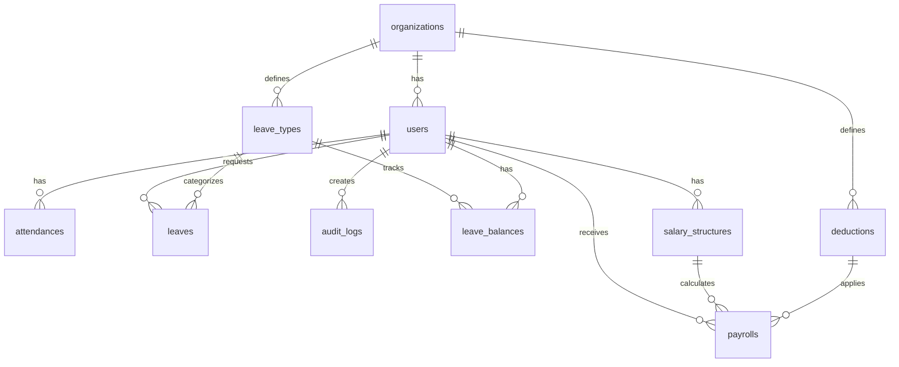

# GOHR - HR Management System Documentation

## Table of Contents
1. [System Overview](#system-overview)
2. [Tech Stack & Architecture](#tech-stack--architecture)
3. [Existing Modules](#existing-modules)
4. [Future Modules](#future-modules)
5. [Database Schema](#database-schema)
6. [API Endpoints](#api-endpoints)
7. [Responsive UI Guidelines](#responsive-ui-guidelines)
8. [Development Setup](#development-setup)
9. [Testing & Deployment](#testing--deployment)

---

## System Overview

GOHR is a multi-tenant HR management platform with modular design and role-based access control. It supports dashboards, attendance tracking, user/role management, and audit logging.

### Key Features
- **Multi-tenant Architecture**: Organization-based data isolation
- **Role-based Access Control**: Four distinct user roles with different permissions
- **Attendance Management**: Automated and manual attendance tracking
- **User Management**: Complete CRUD operations for user accounts
- **Audit Logging**: Comprehensive activity tracking
- **Dashboard Analytics**: Role-specific dashboard views
- **Responsive Design**: Mobile-first Bootstrap 5 implementation

---

## Tech Stack & Architecture

### Technology Stack
- **Backend Framework**: Laravel 12
- **Frontend Framework**: Bootstrap 5 (mobile-first layout)
- **Authentication**: Laravel Breeze
- **Authorization**: Spatie Laravel Permission (roles)
- **Database**: MySQL
- **Package Manager**: Composer (PHP), NPM (Node.js)

### Architecture Patterns
- **MVC Pattern**: Model-View-Controller separation
- **Repository Pattern**: Data access abstraction
- **Service Layer**: Business logic encapsulation
- **Policy-based Authorization**: Model-level permissions
- **Multi-tenant**: Organization-based data isolation

---

## Existing Modules

### 1. User Management Module

**Controller**: `App\Http\Controllers\UserController`
**Model**: `App\Models\User`
**Views**: `resources/views/users/`

#### Features
- Create, read, update, and delete user accounts
- Role assignment and management
- Organization-based user filtering
- Search functionality by name and email
- Password management with secure hashing

#### Key Methods
```php
public function index(Request $request)     // List users with search/pagination
public function store(Request $request)     // Create new user
public function update(Request $request, User $user)  // Update user
public function destroy(User $user)         // Delete user
```

#### Access Control
- **Super Admin**: Can manage users across all organizations
- **HR/Manager**: Can manage users within their organization only

#### Database Schema
```sql
users:
- id (Primary Key)
- name (VARCHAR 255)
- email (VARCHAR 255, Unique)
- email_verified_at (TIMESTAMP NULL)
- password (VARCHAR 255)
- remember_token (VARCHAR 100)
- organization_id (Foreign Key)
- created_at (TIMESTAMP)
- updated_at (TIMESTAMP)
```

### 2. Attendance Management Module

**Controller**: `App\Http\Controllers\AttendanceController`
**Model**: `App\Models\Attendance`
**Views**: `resources/views/attendance/`

#### Features
- Daily attendance tracking
- Manual attendance entry for HR/Managers
- Attendance reports and analytics
- Status classification (Full Day, Half Day, Incomplete)
- Work hours calculation

#### Key Methods
```php
public function index()                     // Current user's today attendance
public function list(Request $request)      // All attendance records
public function manage()                    // Manual entry interface
public function storeManual(Request $request) // Save manual records
public function report(Request $request)    // Generate reports
```

#### Attendance Status Logic
- **Full Day**: 8+ hours (480+ minutes)
- **Half Day**: 4-8 hours (240-480 minutes)
- **Incomplete**: Less than 4 hours

#### Database Schema
```sql
attendances:
- id (Primary Key)
- user_id (Foreign Key)
- date (DATE)
- check_in (DATETIME)
- check_out (DATETIME NULL)
- worked_minutes (INTEGER)
- status (VARCHAR 50)
- created_at (TIMESTAMP)
- updated_at (TIMESTAMP)
```

### 3. Dashboard Module

**Controller**: `App\Http\Controllers\DashboardController`
**Views**: `resources/views/dashboard/`

#### Role-specific Dashboards

##### Super Admin Dashboard
- Total organizations count
- Total users count
- Latest user registrations

##### HR Dashboard
- Employee count in organization
- Today's present employees
- Today's absent employees

##### Manager Dashboard
- Team member count
- Team attendance for today

##### Employee Dashboard
- Monthly attendance summary
- Total worked hours for the month

### 4. Audit Logging Module

**Controller**: `App\Http\Controllers\AuditLogController`
**Model**: `App\Models\AuditLog`
**Views**: `resources/views/audit-log/`

#### Features
- Track all system activities
- User action logging
- Before/after value comparison
- Paginated log viewing

#### Database Schema
```sql
audit_logs:
- id (Primary Key)
- user_id (Foreign Key)
- action (VARCHAR 255)
- auditable_id (INTEGER)
- auditable_type (VARCHAR 255)
- old_values (JSON)
- new_values (JSON)
- created_at (TIMESTAMP)
- updated_at (TIMESTAMP)
```

---

## Future Modules

### 1. Leave Management Module

#### Overview
Comprehensive leave management system with approval workflows, leave balance tracking, and reporting capabilities.

#### Features
- Multiple leave types (Annual, Sick, Personal, Maternity/Paternity)
- Leave application workflow
- Manager/HR approval system
- Leave balance tracking
- Leave calendar view
- Email notifications
- Leave reports and analytics

#### Controller Structure
```php
// app/Http/Controllers/LeaveController.php
class LeaveController extends Controller
{
    public function index()                 // List all leave requests
    public function create()                // Show leave application form
    public function store(Request $request) // Submit leave application
    public function show(Leave $leave)      // View leave details
    public function edit(Leave $leave)      // Edit leave request
    public function update(Request $request, Leave $leave) // Update leave
    public function destroy(Leave $leave)   // Cancel leave request
    public function approve(Leave $leave)   // Approve leave request
    public function reject(Request $request, Leave $leave) // Reject leave
    public function calendar()              // Leave calendar view
    public function report()                // Leave reports
}
```

#### Model Structure
```php
// app/Models/Leave.php
class Leave extends Model
{
    protected $fillable = [
        'user_id',
        'leave_type_id',
        'start_date',
        'end_date',
        'total_days',
        'reason',
        'status',
        'approved_by',
        'approved_at',
        'rejection_reason'
    ];

    protected $casts = [
        'start_date' => 'date',
        'end_date' => 'date',
        'approved_at' => 'datetime'
    ];

    public function user() { /* belongsTo */ }
    public function leaveType() { /* belongsTo */ }
    public function approver() { /* belongsTo */ }
}

// app/Models/LeaveType.php
class LeaveType extends Model
{
    protected $fillable = [
        'name',
        'description',
        'default_days',
        'color',
        'requires_approval',
        'organization_id'
    ];
}

// app/Models/LeaveBalance.php
class LeaveBalance extends Model
{
    protected $fillable = [
        'user_id',
        'leave_type_id',
        'year',
        'total_days',
        'used_days',
        'remaining_days'
    ];
}
```

#### Database Schema
```sql
leave_types:
- id (Primary Key)
- name (VARCHAR 100)
- description (TEXT)
- default_days (INTEGER)
- color (VARCHAR 7)
- requires_approval (BOOLEAN)
- organization_id (Foreign Key)
- created_at (TIMESTAMP)
- updated_at (TIMESTAMP)

leaves:
- id (Primary Key)
- user_id (Foreign Key)
- leave_type_id (Foreign Key)
- start_date (DATE)
- end_date (DATE)
- total_days (DECIMAL 5,2)
- reason (TEXT)
- status (ENUM: pending, approved, rejected, cancelled)
- approved_by (Foreign Key NULL)
- approved_at (TIMESTAMP NULL)
- rejection_reason (TEXT NULL)
- created_at (TIMESTAMP)
- updated_at (TIMESTAMP)

leave_balances:
- id (Primary Key)
- user_id (Foreign Key)
- leave_type_id (Foreign Key)
- year (INTEGER)
- total_days (DECIMAL 5,2)
- used_days (DECIMAL 5,2)
- remaining_days (DECIMAL 5,2)
- created_at (TIMESTAMP)
- updated_at (TIMESTAMP)
```

#### Views Structure
```
resources/views/leave/
├── index.blade.php          # Leave requests list
├── create.blade.php         # Leave application form
├── show.blade.php           # Leave details view
├── edit.blade.php           # Edit leave request
├── calendar.blade.php       # Leave calendar
├── report.blade.php         # Leave reports
└── partials/
    ├── leave-form.blade.php # Reusable form component
    ├── leave-card.blade.php # Leave request card
    └── calendar-widget.blade.php # Calendar component
```

#### Access Control
- **Employee**: Can apply for leave, view own requests
- **Manager**: Can approve/reject team member requests
- **HR**: Can approve/reject all requests, manage leave types
- **Super Admin**: Full access to all leave data

#### Routes
```php
// routes/web.php
Route::middleware('auth')->group(function () {
    Route::resource('leaves', LeaveController::class);
    Route::patch('leaves/{leave}/approve', [LeaveController::class, 'approve'])->name('leaves.approve');
    Route::patch('leaves/{leave}/reject', [LeaveController::class, 'reject'])->name('leaves.reject');
    Route::get('leaves-calendar', [LeaveController::class, 'calendar'])->name('leaves.calendar');
    Route::get('leaves-report', [LeaveController::class, 'report'])->name('leaves.report');
});
```

### 2. Payroll Management Module

#### Overview
Comprehensive payroll system with salary calculation, deductions, tax handling, and report generation.

#### Features
- Salary structure management
- Attendance-based salary calculation
- Deductions and allowances
- Tax calculations
- Payroll reports and PDF export
- Integration with attendance data
- Multiple payment methods
- Payroll history tracking

#### Controller Structure
```php
// app/Http/Controllers/PayrollController.php
class PayrollController extends Controller
{
    public function index()                 // Payroll list
    public function create()                // Generate payroll
    public function store(Request $request) // Process payroll
    public function show(Payroll $payroll)  // Payroll details
    public function edit(Payroll $payroll)  // Edit payroll
    public function update(Request $request, Payroll $payroll) // Update
    public function destroy(Payroll $payroll) // Delete payroll
    public function generate(Request $request) // Generate payroll
    public function export(Payroll $payroll) // Export PDF
    public function report()                // Payroll reports
}

// app/Http/Controllers/SalaryStructureController.php
class SalaryStructureController extends Controller
{
    public function index()                 // Salary structures
    public function create()                // Create structure
    public function store(Request $request) // Save structure
    public function edit(SalaryStructure $structure) // Edit
    public function update(Request $request, SalaryStructure $structure) // Update
    public function destroy(SalaryStructure $structure) // Delete
}
```

#### Model Structure
```php
// app/Models/Payroll.php
class Payroll extends Model
{
    protected $fillable = [
        'user_id',
        'month',
        'year',
        'basic_salary',
        'allowances',
        'deductions',
        'net_salary',
        'working_days',
        'attendance_days',
        'overtime_hours',
        'overtime_amount',
        'status',
        'paid_at',
        'payment_method'
    ];

    protected $casts = [
        'month' => 'integer',
        'year' => 'integer',
        'allowances' => 'array',
        'deductions' => 'array',
        'paid_at' => 'datetime'
    ];

    public function user() { /* belongsTo */ }
    public function salaryStructure() { /* belongsTo */ }
}

// app/Models/SalaryStructure.php
class SalaryStructure extends Model
{
    protected $fillable = [
        'user_id',
        'basic_salary',
        'hra',
        'da',
        'ta',
        'medical_allowance',
        'other_allowances',
        'effective_from',
        'organization_id'
    ];

    protected $casts = [
        'effective_from' => 'date',
        'other_allowances' => 'array'
    ];
}

// app/Models/Deduction.php
class Deduction extends Model
{
    protected $fillable = [
        'name',
        'type',
        'amount',
        'percentage',
        'is_taxable',
        'organization_id'
    ];
}
```

#### Database Schema
```sql
salary_structures:
- id (Primary Key)
- user_id (Foreign Key)
- basic_salary (DECIMAL 10,2)
- hra (DECIMAL 10,2)
- da (DECIMAL 10,2)
- ta (DECIMAL 10,2)
- medical_allowance (DECIMAL 10,2)
- other_allowances (JSON)
- effective_from (DATE)
- organization_id (Foreign Key)
- created_at (TIMESTAMP)
- updated_at (TIMESTAMP)

payrolls:
- id (Primary Key)
- user_id (Foreign Key)
- month (INTEGER)
- year (INTEGER)
- basic_salary (DECIMAL 10,2)
- allowances (JSON)
- deductions (JSON)
- net_salary (DECIMAL 10,2)
- working_days (INTEGER)
- attendance_days (INTEGER)
- overtime_hours (DECIMAL 5,2)
- overtime_amount (DECIMAL 10,2)
- status (ENUM: pending, processed, paid)
- paid_at (TIMESTAMP NULL)
- payment_method (VARCHAR 50)
- created_at (TIMESTAMP)
- updated_at (TIMESTAMP)

deductions:
- id (Primary Key)
- name (VARCHAR 100)
- type (ENUM: fixed, percentage)
- amount (DECIMAL 10,2)
- percentage (DECIMAL 5,2)
- is_taxable (BOOLEAN)
- organization_id (Foreign Key)
- created_at (TIMESTAMP)
- updated_at (TIMESTAMP)
```

#### Views Structure
```
resources/views/payroll/
├── index.blade.php          # Payroll list
├── create.blade.php         # Generate payroll
├── show.blade.php           # Payroll details
├── edit.blade.php           # Edit payroll
├── report.blade.php         # Payroll reports
└── partials/
    ├── payroll-form.blade.php # Payroll generation form
    ├── salary-breakdown.blade.php # Salary breakdown
    ├── deduction-list.blade.php # Deductions list
    └── payslip.blade.php    # Payslip template
```

#### Access Control
- **Employee**: Can view own payroll and payslip
- **Manager**: Can view team payroll reports
- **HR**: Can generate and manage payrolls
- **Super Admin**: Full access to all payroll data

#### Routes
```php
// routes/web.php
Route::middleware('auth')->group(function () {
    Route::resource('payrolls', PayrollController::class);
    Route::post('payrolls/generate', [PayrollController::class, 'generate'])->name('payrolls.generate');
    Route::get('payrolls/{payroll}/export', [PayrollController::class, 'export'])->name('payrolls.export');
    Route::get('payrolls-report', [PayrollController::class, 'report'])->name('payrolls.report');
    
    Route::resource('salary-structures', SalaryStructureController::class);
});
```

---

## Database Schema

### Entity Relationship Diagram



### Complete Schema Overview
- **Core Tables**: users, organizations, attendances, audit_logs
- **Leave Management**: leave_types, leaves, leave_balances
- **Payroll Management**: salary_structures, payrolls, deductions
- **Permission Tables**: roles, permissions, model_has_roles, model_has_permissions, role_has_permissions

---

## API Endpoints

### Authentication Routes
```
POST /login
POST /logout
POST /register
POST /forgot-password
POST /reset-password
GET /verify-email/{id}/{hash}
```

### Protected Routes (Require Authentication)
```
# Dashboard
GET /dashboard

# Profile Management
GET /profile
PATCH /profile
DELETE /profile

# User Management
GET /users
POST /users
PUT /users/{user}
DELETE /users/{user}

# Attendance Management
GET /attendances
GET /attendances/list
GET /attendances/report
GET /attendances/manage
POST /attendances/manage

# Leave Management
GET /leaves
POST /leaves
GET /leaves/{leave}
PUT /leaves/{leave}
DELETE /leaves/{leave}
PATCH /leaves/{leave}/approve
PATCH /leaves/{leave}/reject
GET /leaves-calendar
GET /leaves-report

# Payroll Management
GET /payrolls
POST /payrolls
GET /payrolls/{payroll}
PUT /payrolls/{payroll}
DELETE /payrolls/{payroll}
POST /payrolls/generate
GET /payrolls/{payroll}/export
GET /payrolls-report

# Salary Structures
GET /salary-structures
POST /salary-structures
PUT /salary-structures/{structure}
DELETE /salary-structures/{structure}

# Audit Log
GET /audit-log
```

---

## Responsive UI Guidelines

### Bootstrap 5 Implementation

#### Mobile-First Approach
All components must be responsive at breakpoints:
- **Mobile**: 320px - 767px
- **Tablet**: 768px - 1023px
- **Desktop**: 1024px+

#### Responsive Grid System
```html
<!-- Example: Responsive form layout -->
<div class="row">
    <div class="col-12 col-md-6 col-lg-4">
        <div class="form-group">
            <label for="name">Name</label>
            <input type="text" class="form-control form-control-sm" id="name">
        </div>
    </div>
    <div class="col-12 col-md-6 col-lg-4">
        <div class="form-group">
            <label for="email">Email</label>
            <input type="email" class="form-control form-control-sm" id="email">
        </div>
    </div>
</div>
```

#### Table Responsiveness
```html
<!-- Always wrap tables for mobile responsiveness -->
<div class="table-responsive">
    <table class="table table-striped table-hover">
        <thead class="table-dark">
            <tr>
                <th>Name</th>
                <th>Email</th>
                <th>Role</th>
                <th>Actions</th>
            </tr>
        </thead>
        <tbody>
            <!-- Table content -->
        </tbody>
    </table>
</div>
```

#### Form Components
```html
<!-- Responsive form with proper spacing -->
<form class="needs-validation" novalidate>
    <div class="row g-3">
        <div class="col-12 col-md-6">
            <label for="firstName" class="form-label">First name</label>
            <input type="text" class="form-control form-control-sm" id="firstName" required>
            <div class="invalid-feedback">
                Valid first name is required.
            </div>
        </div>
        <div class="col-12 col-md-6">
            <label for="lastName" class="form-label">Last name</label>
            <input type="text" class="form-control form-control-sm" id="lastName" required>
            <div class="invalid-feedback">
                Valid last name is required.
            </div>
        </div>
    </div>
    
    <div class="row mt-3">
        <div class="col-12">
            <button class="btn btn-primary btn-sm" type="submit">Submit</button>
            <button class="btn btn-secondary btn-sm" type="button">Cancel</button>
        </div>
    </div>
</form>
```

#### Card Components
```html
<!-- Responsive card layout -->
<div class="row row-cols-1 row-cols-md-2 row-cols-lg-3 g-4">
    <div class="col">
        <div class="card h-100">
            <div class="card-header">
                <h5 class="card-title mb-0">Card Title</h5>
            </div>
            <div class="card-body">
                <p class="card-text">Card content goes here.</p>
            </div>
            <div class="card-footer">
                <button class="btn btn-primary btn-sm">Action</button>
            </div>
        </div>
    </div>
</div>
```

#### Navigation Components
```html
<!-- Responsive navigation -->
<nav class="navbar navbar-expand-lg navbar-dark bg-dark">
    <div class="container-fluid">
        <a class="navbar-brand" href="#">GOHR</a>
        
        <button class="navbar-toggler" type="button" data-bs-toggle="collapse" data-bs-target="#navbarNav">
            <span class="navbar-toggler-icon"></span>
        </button>
        
        <div class="collapse navbar-collapse" id="navbarNav">
            <ul class="navbar-nav me-auto">
                <li class="nav-item">
                    <a class="nav-link" href="{{ route('dashboard') }}">Dashboard</a>
                </li>
                <li class="nav-item">
                    <a class="nav-link" href="{{ route('users.index') }}">Users</a>
                </li>
            </ul>
            
            <ul class="navbar-nav">
                <li class="nav-item dropdown">
                    <a class="nav-link dropdown-toggle" href="#" role="button" data-bs-toggle="dropdown">
                        {{ Auth::user()->name }}
                    </a>
                    <ul class="dropdown-menu">
                        <li><a class="dropdown-item" href="{{ route('profile.edit') }}">Profile</a></li>
                        <li><hr class="dropdown-divider"></li>
                        <li><a class="dropdown-item" href="{{ route('logout') }}">Logout</a></li>
                    </ul>
                </li>
            </ul>
        </div>
    </div>
</nav>
```

#### Modal Components
```html
<!-- Responsive modal -->
<div class="modal fade" id="exampleModal" tabindex="-1">
    <div class="modal-dialog modal-dialog-centered modal-dialog-scrollable">
        <div class="modal-content">
            <div class="modal-header">
                <h5 class="modal-title">Modal Title</h5>
                <button type="button" class="btn-close" data-bs-dismiss="modal"></button>
            </div>
            <div class="modal-body">
                <!-- Modal content -->
            </div>
            <div class="modal-footer">
                <button type="button" class="btn btn-secondary btn-sm" data-bs-dismiss="modal">Close</button>
                <button type="button" class="btn btn-primary btn-sm">Save changes</button>
            </div>
        </div>
    </div>
</div>
```

#### Utility Classes
```css
/* Custom utility classes for consistent spacing */
.mt-responsive { margin-top: 1rem; }
@media (min-width: 768px) { .mt-responsive { margin-top: 1.5rem; } }
@media (min-width: 1024px) { .mt-responsive { margin-top: 2rem; } }

.p-responsive { padding: 1rem; }
@media (min-width: 768px) { .p-responsive { padding: 1.5rem; } }
@media (min-width: 1024px) { .p-responsive { padding: 2rem; } }
```

---

## Development Setup

### Prerequisites
- PHP 8.2 or higher
- Composer
- Node.js and NPM
- MySQL 8.0 or higher
- Git

### Installation Steps

1. **Clone the repository**
   ```bash
   git clone <repository-url>
   cd GOHR
   ```

2. **Install PHP dependencies**
   ```bash
   composer install
   ```

3. **Install Node.js dependencies**
   ```bash
   npm install
   ```

4. **Environment setup**
   ```bash
   cp .env.example .env
   php artisan key:generate
   ```

5. **Database setup**
   ```bash
   php artisan migrate
   php artisan db:seed
   ```

6. **Start development server**
   ```bash
   php artisan serve
   npm run dev
   ```

### Database Seeding
```bash
# Run all seeders
php artisan db:seed

# Run specific seeders
php artisan db:seed --class=RolesAndPermissionsSeeder
php artisan db:seed --class=UserSeeder
php artisan db:seed --class=AttendanceSeeder
```

### Testing
```bash
# Run all tests
php artisan test

# Run specific test suite
php artisan test --filter=AuthenticationTest
php artisan test --filter=UserManagementTest
php artisan test --filter=AttendanceTest
```

---

## Testing & Deployment

### Testing Strategy

#### Unit Tests
```php
// tests/Unit/LeaveTest.php
class LeaveTest extends TestCase
{
    public function test_can_create_leave_request()
    {
        $user = User::factory()->create();
        $leaveType = LeaveType::factory()->create();
        
        $leave = Leave::create([
            'user_id' => $user->id,
            'leave_type_id' => $leaveType->id,
            'start_date' => '2025-01-15',
            'end_date' => '2025-01-17',
            'reason' => 'Personal leave'
        ]);
        
        $this->assertDatabaseHas('leaves', [
            'user_id' => $user->id,
            'status' => 'pending'
        ]);
    }
}
```

#### Feature Tests
```php
// tests/Feature/LeaveManagementTest.php
class LeaveManagementTest extends TestCase
{
    public function test_hr_can_approve_leave_request()
    {
        $hr = User::factory()->create()->assignRole('HR');
        $employee = User::factory()->create()->assignRole('Employee');
        $leave = Leave::factory()->create(['user_id' => $employee->id]);
        
        $response = $this->actingAs($hr)
            ->patch(route('leaves.approve', $leave));
        
        $response->assertRedirect();
        $this->assertDatabaseHas('leaves', [
            'id' => $leave->id,
            'status' => 'approved',
            'approved_by' => $hr->id
        ]);
    }
}
```

### Deployment Checklist

#### Pre-deployment
- [ ] Run all tests: `php artisan test`
- [ ] Check code quality: `./vendor/bin/pint`
- [ ] Optimize for production: `php artisan config:cache`
- [ ] Update dependencies: `composer install --optimize-autoloader --no-dev`

#### Environment Configuration
```env
APP_ENV=production
APP_DEBUG=false
APP_URL=https://your-domain.com

DB_CONNECTION=mysql
DB_HOST=your-db-host
DB_PORT=3306
DB_DATABASE=your-database
DB_USERNAME=your-username
DB_PASSWORD=your-password

CACHE_DRIVER=redis
SESSION_DRIVER=redis
QUEUE_CONNECTION=redis
```

#### Security Measures
- [ ] HTTPS enabled
- [ ] Database backups configured
- [ ] File permissions set correctly
- [ ] Environment variables secured
- [ ] Rate limiting configured
- [ ] CSRF protection enabled

---

## Maintenance & Monitoring

### Log Management
- Application logs: `storage/logs/laravel.log`
- Error tracking through Laravel's logging system
- Custom audit logs in database

### Performance Optimization
- Database indexing on frequently queried columns
- Eager loading for relationship queries
- Pagination for large datasets
- Caching for permission checks
- Redis for session and cache storage

### Backup Strategy
- Daily database backups
- Weekly file system backups
- Monthly configuration backups
- Version control for all code changes

---

**Documentation Version**: 2.0  
**Last Updated**: January 2025  
**System Version**: Laravel 12.x  
**Frontend Framework**: Bootstrap 5.x 