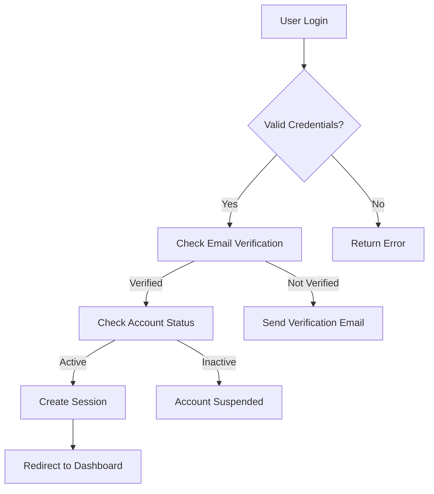
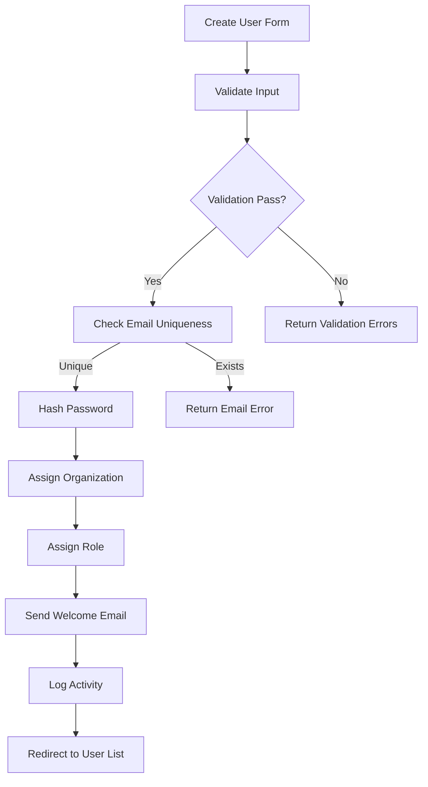
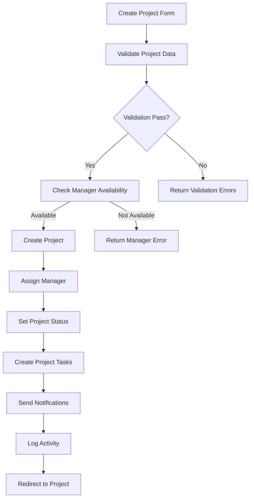
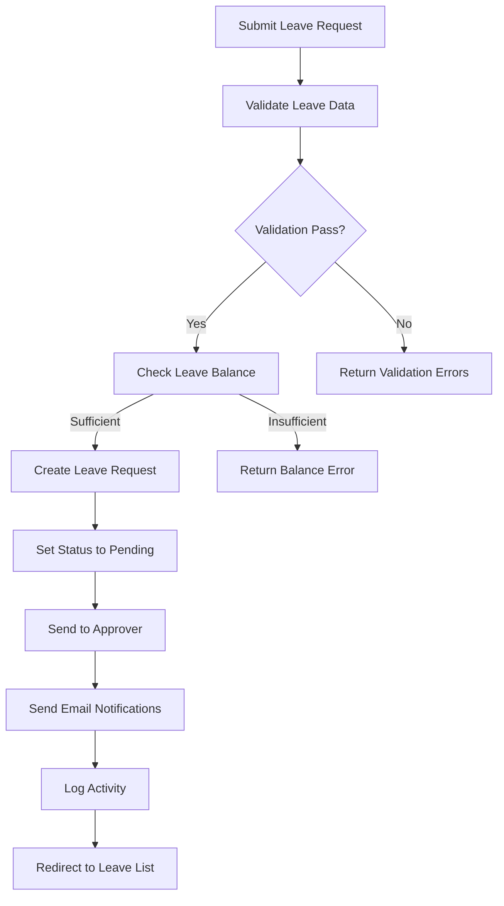

# GOHR - Logic Documentation

## Table of Contents
1. [System Architecture Logic](#system-architecture-logic)
2. [Authentication & Authorization Logic](#authentication--authorization-logic)
3. [User Management Logic](#user-management-logic)
4. [Attendance Management Logic](#attendance-management-logic)
5. [Dashboard Logic](#dashboard-logic)
6. [Audit Logging Logic](#audit-logging-logic)
7. [Project Management Logic](#project-management-logic)
8. [Leave Management Logic](#leave-management-logic)
9. [Payroll Management Logic](#payroll-management-logic)
10. [Data Flow & Integration Logic](#data-flow--integration-logic)

---

## System Architecture Logic

### Multi-Tenant Architecture
```php
// Organization-based data isolation
class User extends Authenticatable
{
    protected static function booted()
    {
        static::addGlobalScope('organization', function ($query) {
            if (!auth()->user()->hasRole('Super Admin')) {
                $query->where('organization_id', auth()->user()->organization_id);
            }
        });
    }
}
```

### Role-Based Access Control (RBAC)
```php
// Permission hierarchy
Super Admin > HR > Manager > Employee

// Permission inheritance
Manager inherits Employee permissions
HR inherits Manager permissions
Super Admin inherits all permissions
```

---

## Authentication & Authorization Logic

### User Authentication Flow


### Authorization Logic
```php
// Policy-based authorization
class UserPolicy
{
    public function viewAny(User $user): bool
    {
        return $user->hasAnyRole(['Super Admin', 'HR', 'Manager']);
    }
    
    public function view(User $user, User $model): bool
    {
        if ($user->hasRole('Super Admin')) return true;
        return $user->organization_id === $model->organization_id;
    }
}
```

### Session Management
```php
// Session timeout logic
'session' => [
    'lifetime' => env('SESSION_LIFETIME', 120), // 2 hours
    'expire_on_close' => true,
    'secure' => env('SESSION_SECURE_COOKIE', true),
]
```

---

## User Management Logic

### User Creation Workflow


### User Update Logic
```php
// User update with role change
public function update(Request $request, User $user)
{
    // Validate permissions
    $this->authorize('update', $user);
    
    // Update basic info
    $user->update($request->validated());
    
    // Handle role change
    if ($request->role !== $user->roles->first()->name) {
        $oldRole = $user->roles->first()->name;
        $user->syncRoles($request->role);
        
        // Log role change
        AuditLog::create([
            'user_id' => auth()->id(),
            'action' => 'role_changed',
            'auditable_id' => $user->id,
            'auditable_type' => User::class,
            'old_values' => ['role' => $oldRole],
            'new_values' => ['role' => $request->role]
        ]);
    }
}
```

### User Deletion Logic
```php
// Soft delete with data preservation
public function destroy(User $user)
{
    // Check for active projects
    if ($user->projects()->where('status', 'active')->exists()) {
        return back()->withErrors(['Cannot delete user with active projects']);
    }
    
    // Archive user data
    $user->update(['status' => 'inactive']);
    
    // Log deletion
    AuditLog::create([
        'user_id' => auth()->id(),
        'action' => 'user_deleted',
        'auditable_id' => $user->id,
        'auditable_type' => User::class,
        'old_values' => $user->toArray()
    ]);
}
```

---

## Attendance Management Logic

### Attendance Status Calculation
```php
// Attendance status logic
class Attendance extends Model
{
    public function calculateStatus(): string
    {
        $workedMinutes = $this->worked_minutes ?? 0;
        
        if ($workedMinutes >= 480) { // 8 hours
            return 'Full Day';
        } elseif ($workedMinutes >= 240) { // 4 hours
            return 'Half Day';
        } else {
            return 'Incomplete';
        }
    }
    
    public function calculateWorkedMinutes(): int
    {
        if (!$this->check_in || !$this->check_out) {
            return 0;
        }
        
        return Carbon::parse($this->check_in)
            ->diffInMinutes(Carbon::parse($this->check_out));
    }
}
```

### Check-in/Check-out Logic
```php
// Daily attendance tracking
public function checkIn()
{
    $today = Carbon::today();
    $user = auth()->user();
    
    // Check if already checked in today
    $existingAttendance = Attendance::where('user_id', $user->id)
        ->where('date', $today)
        ->first();
    
    if ($existingAttendance) {
        return back()->withErrors(['Already checked in today']);
    }
    
    // Create new attendance record
    $attendance = Attendance::create([
        'user_id' => $user->id,
        'date' => $today,
        'check_in' => Carbon::now(),
        'status' => 'Incomplete'
    ]);
    
    // Log activity
    AuditLog::create([
        'user_id' => $user->id,
        'action' => 'check_in',
        'auditable_id' => $attendance->id,
        'auditable_type' => Attendance::class
    ]);
}
```

### Manual Attendance Entry Logic
```php
// HR/Manager manual entry
public function storeManual(Request $request)
{
    $this->authorize('create', Attendance::class);
    
    foreach ($request->attendances as $attendanceData) {
        $user = User::find($attendanceData['user_id']);
        
        // Validate user belongs to same organization
        if ($user->organization_id !== auth()->user()->organization_id) {
            continue;
        }
        
        $attendance = Attendance::updateOrCreate(
            [
                'user_id' => $user->id,
                'date' => $attendanceData['date']
            ],
            [
                'check_in' => $attendanceData['check_in'],
                'check_out' => $attendanceData['check_out'],
                'worked_minutes' => $this->calculateWorkedMinutes(
                    $attendanceData['check_in'],
                    $attendanceData['check_out']
                )
            ]
        );
        
        $attendance->update(['status' => $attendance->calculateStatus()]);
    }
}
```

---

## Dashboard Logic

### Role-Specific Data Aggregation
```php
// Dashboard data logic by role
class DashboardController extends Controller
{
    private function getSuperAdminData(): array
    {
        return [
            'organizations_count' => Organization::count(),
            'users_count' => User::count(),
            'latest_users' => User::with('organization')->latest()->take(5)->get(),
            'monthly_user_growth' => $this->getMonthlyUserGrowth(),
            'recent_activities' => AuditLog::with('user')->latest()->take(10)->get(),
            'organizations' => Organization::withCount('users')->get(),
            'today_activities' => AuditLog::whereDate('created_at', today())->count()
        ];
    }
    
    private function getHRData(User $user): array
    {
        return [
            'employee_count' => User::where('organization_id', $user->organization_id)->count(),
            'today_present' => Attendance::whereHas('user', function($q) use ($user) {
                $q->where('organization_id', $user->organization_id);
            })->where('date', today())->where('status', '!=', 'Incomplete')->count(),
            'today_absent' => $this->calculateAbsentEmployees($user->organization_id),
            'attendance_rate' => $this->calculateAttendanceRate($user->organization_id),
            'recent_activities' => AuditLog::whereHas('user', function($q) use ($user) {
                $q->where('organization_id', $user->organization_id);
            })->latest()->take(10)->get()
        ];
    }
}
```

### Real-Time Statistics Calculation
```php
// Attendance rate calculation
private function calculateAttendanceRate(int $organizationId): float
{
    $totalEmployees = User::where('organization_id', $organizationId)->count();
    $presentToday = Attendance::whereHas('user', function($q) use ($organizationId) {
        $q->where('organization_id', $organizationId);
    })->where('date', today())->where('status', '!=', 'Incomplete')->count();
    
    return $totalEmployees > 0 ? ($presentToday / $totalEmployees) * 100 : 0;
}
```

---

## Audit Logging Logic

### Automatic Activity Tracking
```php
// Observer pattern for automatic logging
class AttendanceObserver
{
    public function created(Attendance $attendance): void
    {
        AuditLog::create([
            'user_id' => auth()->id(),
            'action' => 'attendance_created',
            'auditable_id' => $attendance->id,
            'auditable_type' => Attendance::class,
            'new_values' => $attendance->toArray()
        ]);
    }
    
    public function updated(Attendance $attendance): void
    {
        AuditLog::create([
            'user_id' => auth()->id(),
            'action' => 'attendance_updated',
            'auditable_id' => $attendance->id,
            'auditable_type' => Attendance::class,
            'old_values' => $attendance->getOriginal(),
            'new_values' => $attendance->getChanges()
        ]);
    }
}
```

### Login/Logout Tracking
```php
// Event listeners for authentication
class LoginSuccessful
{
    public function handle(Login $event): void
    {
        AuditLog::create([
            'user_id' => $event->user->id,
            'action' => 'user_login',
            'auditable_id' => $event->user->id,
            'auditable_type' => User::class,
            'new_values' => ['login_time' => now()]
        ]);
    }
}
```

---

## Project Management Logic

### Project Creation Workflow


### Manager Assignment Logic
```php
// Project manager assignment
public function assignManager(Request $request, Project $project)
{
    $this->authorize('update', $project);
    
    $manager = User::find($request->manager_id);
    
    // Validate manager belongs to same organization
    if ($manager->organization_id !== $project->organization_id) {
        return back()->withErrors(['Manager must belong to same organization']);
    }
    
    // Check manager role
    if (!$manager->hasRole('Manager')) {
        return back()->withErrors(['Selected user must have Manager role']);
    }
    
    // Check manager's current project load
    $activeProjects = Project::where('manager_id', $manager->id)
        ->where('status', 'active')
        ->count();
    
    if ($activeProjects >= 5) { // Max 5 active projects per manager
        return back()->withErrors(['Manager has maximum active projects']);
    }
    
    // Update project manager
    $oldManagerId = $project->manager_id;
    $project->update(['manager_id' => $manager->id]);
    
    // Add manager to project members
    ProjectMember::updateOrCreate(
        [
            'project_id' => $project->id,
            'user_id' => $manager->id
        ],
        [
            'role' => 'manager',
            'joined_date' => now()
        ]
    );
    
    // Log manager change
    AuditLog::create([
        'user_id' => auth()->id(),
        'action' => 'project_manager_changed',
        'auditable_id' => $project->id,
        'auditable_type' => Project::class,
        'old_values' => ['manager_id' => $oldManagerId],
        'new_values' => ['manager_id' => $manager->id]
    ]);
}
```

### Team Member Addition Logic
```php
// Add employee to project
public function addMember(Request $request, Project $project)
{
    $this->authorize('update', $project);
    
    $employee = User::find($request->user_id);
    
    // Validate employee belongs to same organization
    if ($employee->organization_id !== $project->organization_id) {
        return back()->withErrors(['Employee must belong to same organization']);
    }
    
    // Check if already a member
    if ($project->members()->where('user_id', $employee->id)->exists()) {
        return back()->withErrors(['Employee is already a project member']);
    }
    
    // Check employee's current project load
    $activeProjects = ProjectMember::where('user_id', $employee->id)
        ->whereHas('project', function($q) {
            $q->where('status', 'active');
        })->count();
    
    if ($activeProjects >= 3) { // Max 3 active projects per employee
        return back()->withErrors(['Employee has maximum active projects']);
    }
    
    // Add to project
    ProjectMember::create([
        'project_id' => $project->id,
        'user_id' => $employee->id,
        'role' => $request->role ?? 'member',
        'joined_date' => now()
    ]);
    
    // Log member addition
    AuditLog::create([
        'user_id' => auth()->id(),
        'action' => 'project_member_added',
        'auditable_id' => $project->id,
        'auditable_type' => Project::class,
        'new_values' => [
            'member_id' => $employee->id,
            'role' => $request->role ?? 'member'
        ]
    ]);
}
```

### Project Status Management
```php
// Project status transitions
class Project extends Model
{
    protected $fillable = ['status'];
    
    public function updateStatus(string $newStatus): bool
    {
        $validTransitions = [
            'active' => ['completed', 'on_hold', 'cancelled'],
            'on_hold' => ['active', 'cancelled'],
            'completed' => [], // Terminal state
            'cancelled' => []  // Terminal state
        ];
        
        $currentStatus = $this->status;
        
        if (!in_array($newStatus, $validTransitions[$currentStatus] ?? [])) {
            return false;
        }
        
        $this->update(['status' => $newStatus]);
        
        // Handle status-specific actions
        if ($newStatus === 'completed') {
            $this->handleProjectCompletion();
        } elseif ($newStatus === 'cancelled') {
            $this->handleProjectCancellation();
        }
        
        return true;
    }
    
    private function handleProjectCompletion(): void
    {
        // Update all tasks to completed
        $this->tasks()->update(['status' => 'completed']);
        
        // Calculate project metrics
        $this->calculateProjectMetrics();
        
        // Send completion notifications
        $this->sendCompletionNotifications();
    }
}
```

---

## Leave Management Logic

### Leave Application Workflow


### Leave Balance Calculation
```php
// Leave balance management
class LeaveBalance extends Model
{
    public function calculateRemainingDays(): float
    {
        return $this->total_days - $this->used_days;
    }
    
    public function canTakeLeave(float $requestedDays): bool
    {
        return $this->calculateRemainingDays() >= $requestedDays;
    }
    
    public function updateUsedDays(float $days): void
    {
        $this->increment('used_days', $days);
        $this->update(['remaining_days' => $this->calculateRemainingDays()]);
    }
}
```

### Leave Approval Logic
```php
// Leave approval workflow
public function approve(Leave $leave)
{
    $this->authorize('approve', $leave);
    
    // Check if already approved/rejected
    if ($leave->status !== 'pending') {
        return back()->withErrors(['Leave request already processed']);
    }
    
    // Update leave status
    $leave->update([
        'status' => 'approved',
        'approved_by' => auth()->id(),
        'approved_at' => now()
    ]);
    
    // Update leave balance
    $leaveBalance = LeaveBalance::where('user_id', $leave->user_id)
        ->where('leave_type_id', $leave->leave_type_id)
        ->where('year', now()->year)
        ->first();
    
    $leaveBalance->updateUsedDays($leave->total_days);
    
    // Send approval notification
    $leave->user->notify(new LeaveApproved($leave));
    
    // Log approval
    AuditLog::create([
        'user_id' => auth()->id(),
        'action' => 'leave_approved',
        'auditable_id' => $leave->id,
        'auditable_type' => Leave::class,
        'new_values' => [
            'status' => 'approved',
            'approved_by' => auth()->id(),
            'approved_at' => now()
        ]
    ]);
}
```

---

## Payroll Management Logic

### Salary Calculation Logic
```php
// Payroll calculation engine
class PayrollCalculator
{
    public function calculatePayroll(User $user, int $month, int $year): array
    {
        $salaryStructure = $user->salaryStructure;
        $attendance = $this->getMonthlyAttendance($user, $month, $year);
        
        $basicSalary = $salaryStructure->basic_salary;
        $allowances = $this->calculateAllowances($salaryStructure);
        $deductions = $this->calculateDeductions($salaryStructure, $attendance);
        $overtime = $this->calculateOvertime($attendance);
        
        $grossSalary = $basicSalary + $allowances + $overtime;
        $netSalary = $grossSalary - $deductions;
        
        return [
            'basic_salary' => $basicSalary,
            'allowances' => $allowances,
            'deductions' => $deductions,
            'overtime' => $overtime,
            'gross_salary' => $grossSalary,
            'net_salary' => $netSalary,
            'working_days' => $this->getWorkingDays($month, $year),
            'attendance_days' => $attendance->count(),
            'overtime_hours' => $this->calculateOvertimeHours($attendance)
        ];
    }
    
    private function calculateAllowances(SalaryStructure $structure): float
    {
        return $structure->hra + $structure->da + $structure->ta + 
               $structure->medical_allowance + array_sum($structure->other_allowances);
    }
    
    private function calculateDeductions(SalaryStructure $structure, Collection $attendance): float
    {
        $totalDeductions = 0;
        
        // Attendance-based deductions
        $absentDays = $this->getWorkingDays() - $attendance->count();
        $perDaySalary = $structure->basic_salary / $this->getWorkingDays();
        $totalDeductions += $absentDays * $perDaySalary;
        
        // Fixed deductions
        foreach ($structure->deductions as $deduction) {
            if ($deduction['type'] === 'fixed') {
                $totalDeductions += $deduction['amount'];
            } elseif ($deduction['type'] === 'percentage') {
                $totalDeductions += ($structure->basic_salary * $deduction['percentage']) / 100;
            }
        }
        
        return $totalDeductions;
    }
}
```

### Payroll Generation Logic
```php
// Payroll generation workflow
public function generate(Request $request)
{
    $this->authorize('create', Payroll::class);
    
    $month = $request->month;
    $year = $request->year;
    $users = $this->getEligibleUsers($request->organization_id);
    
    $generatedPayrolls = [];
    
    foreach ($users as $user) {
        // Check if payroll already exists
        if (Payroll::where('user_id', $user->id)
            ->where('month', $month)
            ->where('year', $year)
            ->exists()) {
            continue;
        }
        
        // Calculate payroll
        $calculator = new PayrollCalculator();
        $payrollData = $calculator->calculatePayroll($user, $month, $year);
        
        // Create payroll record
        $payroll = Payroll::create([
            'user_id' => $user->id,
            'month' => $month,
            'year' => $year,
            'basic_salary' => $payrollData['basic_salary'],
            'allowances' => $payrollData['allowances'],
            'deductions' => $payrollData['deductions'],
            'net_salary' => $payrollData['net_salary'],
            'working_days' => $payrollData['working_days'],
            'attendance_days' => $payrollData['attendance_days'],
            'overtime_hours' => $payrollData['overtime_hours'],
            'overtime_amount' => $payrollData['overtime'],
            'status' => 'pending'
        ]);
        
        $generatedPayrolls[] = $payroll;
    }
    
    // Log payroll generation
    AuditLog::create([
        'user_id' => auth()->id(),
        'action' => 'payroll_generated',
        'auditable_type' => Payroll::class,
        'new_values' => [
            'month' => $month,
            'year' => $year,
            'count' => count($generatedPayrolls)
        ]
    ]);
    
    return $generatedPayrolls;
}
```

---

## Data Flow & Integration Logic

### Cross-Module Data Integration
```php
// Integration between modules
class User extends Authenticatable
{
    // Attendance integration
    public function attendances()
    {
        return $this->hasMany(Attendance::class);
    }
    
    // Project integration
    public function managedProjects()
    {
        return $this->hasMany(Project::class, 'manager_id');
    }
    
    public function projectMemberships()
    {
        return $this->hasMany(ProjectMember::class);
    }
    
    // Leave integration
    public function leaves()
    {
        return $this->hasMany(Leave::class);
    }
    
    public function leaveBalances()
    {
        return $this->hasMany(LeaveBalance::class);
    }
    
    // Payroll integration
    public function payrolls()
    {
        return $this->hasMany(Payroll::class);
    }
    
    public function salaryStructure()
    {
        return $this->hasOne(SalaryStructure::class);
    }
}
```

### Real-Time Data Synchronization
```php
// Event-driven data updates
class AttendanceUpdated
{
    public function handle(Attendance $attendance): void
    {
        // Update project attendance if user is on project
        if ($attendance->user->projectMemberships()->whereHas('project', function($q) {
            $q->where('status', 'active');
        })->exists()) {
            $this->updateProjectAttendance($attendance);
        }
        
        // Update payroll calculations if month is current
        if ($attendance->date->format('Y-m') === now()->format('Y-m')) {
            $this->updatePayrollCalculations($attendance);
        }
        
        // Update dashboard statistics
        $this->updateDashboardStats($attendance);
    }
}
```

### Data Validation & Business Rules
```php
// Business rule validation
class BusinessRuleValidator
{
    public function validateLeaveRequest(Leave $leave): array
    {
        $errors = [];
        
        // Check overlapping leaves
        $overlappingLeaves = Leave::where('user_id', $leave->user_id)
            ->where('status', 'approved')
            ->where(function($q) use ($leave) {
                $q->whereBetween('start_date', [$leave->start_date, $leave->end_date])
                  ->orWhereBetween('end_date', [$leave->start_date, $leave->end_date]);
            })->exists();
        
        if ($overlappingLeaves) {
            $errors[] = 'Leave request overlaps with existing approved leave';
        }
        
        // Check minimum notice period
        $noticeDays = $leave->start_date->diffInDays(now());
        if ($noticeDays < 3) {
            $errors[] = 'Leave request must be submitted at least 3 days in advance';
        }
        
        return $errors;
    }
    
    public function validateProjectAssignment(Project $project, User $user): array
    {
        $errors = [];
        
        // Check user availability
        $activeProjects = $user->projectMemberships()
            ->whereHas('project', function($q) {
                $q->where('status', 'active');
            })->count();
        
        if ($activeProjects >= 3) {
            $errors[] = 'User has maximum active projects';
        }
        
        // Check project timeline
        if ($project->end_date < now()) {
            $errors[] = 'Cannot assign user to completed project';
        }
        
        return $errors;
    }
}
```

---

## Performance Optimization Logic

### Database Query Optimization
```php
// Eager loading for complex relationships
class DashboardController extends Controller
{
    public function getSuperAdminData(): array
    {
        return [
            'organizations' => Organization::withCount(['users', 'projects', 'leaves'])->get(),
            'latest_users' => User::with(['organization', 'roles', 'attendances' => function($q) {
                $q->latest()->take(5);
            }])->latest()->take(5)->get(),
            'recent_activities' => AuditLog::with(['user', 'auditable'])->latest()->take(10)->get()
        ];
    }
}
```

### Caching Strategy
```php
// Cache frequently accessed data
class DashboardService
{
    public function getAttendanceStats(int $organizationId): array
    {
        return Cache::remember("attendance_stats_{$organizationId}", 300, function() use ($organizationId) {
            return [
                'today_present' => $this->calculateTodayPresent($organizationId),
                'today_absent' => $this->calculateTodayAbsent($organizationId),
                'attendance_rate' => $this->calculateAttendanceRate($organizationId)
            ];
        });
    }
}
```

---

## Security Logic

### Data Access Control
```php
// Organization-based data filtering
class OrganizationScope
{
    public function apply($query, Model $model)
    {
        $user = auth()->user();
        
        if ($user->hasRole('Super Admin')) {
            return $query;
        }
        
        return $query->where('organization_id', $user->organization_id);
    }
}
```

### Input Validation & Sanitization
```php
// Comprehensive validation rules
class ValidationRules
{
    public static function userRules(): array
    {
        return [
            'name' => ['required', 'string', 'max:255'],
            'email' => ['required', 'email', 'unique:users,email'],
            'password' => ['required', 'string', 'min:8', 'confirmed'],
            'organization_id' => ['required', 'exists:organizations,id'],
            'role' => ['required', 'exists:roles,name']
        ];
    }
    
    public static function projectRules(): array
    {
        return [
            'name' => ['required', 'string', 'max:255'],
            'description' => ['required', 'string'],
            'start_date' => ['required', 'date', 'after_or_equal:today'],
            'end_date' => ['required', 'date', 'after:start_date'],
            'manager_id' => ['required', 'exists:users,id'],
            'budget' => ['nullable', 'numeric', 'min:0']
        ];
    }
}
```

---

**Document Version**: 1.0  
**Last Updated**: January 2025  
**Next Review**: February 2025  
**Status**: Active Development 